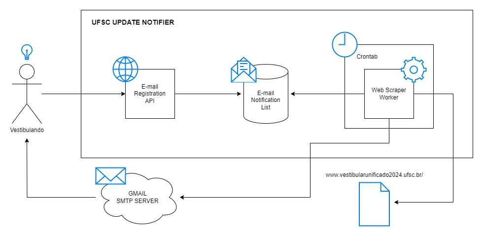
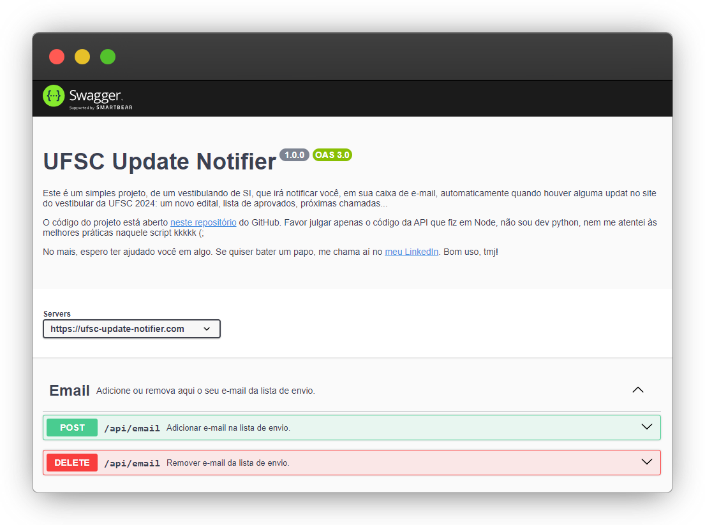
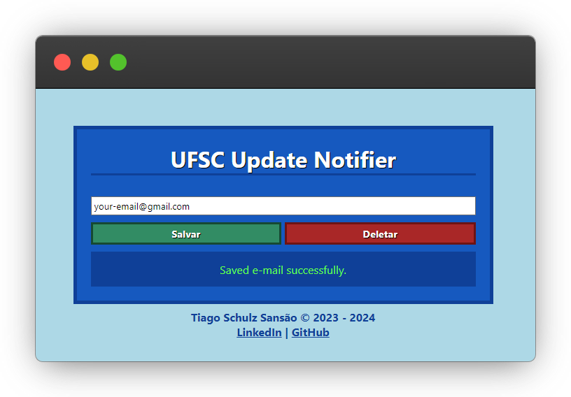

# UFSC Update Notifier

This is a solution that notifies a list of registered e-mails addresses whenever there is a new update on [UFSC 2024 Vestibular site](https://vestibularunificado2024.ufsc.br/).

This project started as a simple script I'd do only to solve my own on pain and fear of losing any update on the vestibular site, since any inattention may cause a loss of place. But, while developing, it randomly happened to me that I could publish this service online and enable everyone to use it. So, that's what I did by creating an API that will register e-mails, and then, the script that would only send to me, will send e-mails to every entry of the list.

Hope you make good use (;

## Architecture

## Docs

Swagger with REST API documentation is available at `/docs`.

# Front-end

If you are reading this, you are probably able to consume the API using the Swagger. Anyway, since I am going to post this project on LinkedIn, I made a really simple front-end so usual people can use the application easily.

---

🔥 Developed by Tiago Schulz Sansão  
👋 [Check my LinkedIn](https://www.linkedin.com/in/tiago-sansao/)
